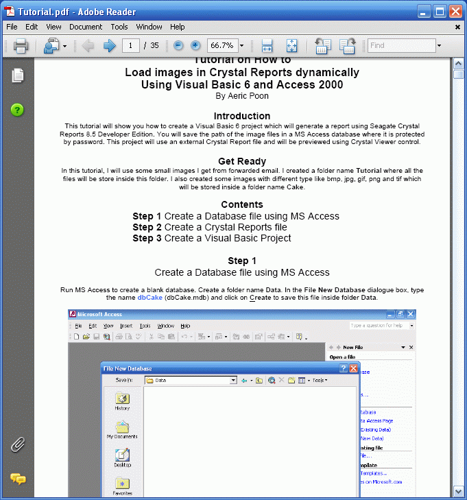



## Tutorial on How to Load images in Crystal Reports dynamically Using Visual Basic 6 and Access 2000

### Description

This tutorial will show you how to create a Visual Basic 6 project which will generate a report using Seagate Crystal Reports 8.5 Developer Edition. You will save the path of the image files in a MS Access database where it is protected by password. This project will use an external Crystal Report file and will be previewed using Crystal Viewer control.
 
### More Info
 

             |
---                |---
**Submitted On**   |2008-01-28 14:25:56
**By**             |[Aeric](https://github.com/Planet-Source-Code/PSCIndex/blob/master/ByAuthor/aeric.md)
**Level**          |Beginner
**User Rating**    |4.9 (39 globes from 8 users)
**Compatibility**  |VB 6\.0
**Category**       |[Databases/ Data Access/ DAO/ ADO](https://github.com/Planet-Source-Code/PSCIndex/blob/master/ByCategory/databases-data-access-dao-ado__1-6.md)
**World**          |[Visual Basic](https://github.com/Planet-Source-Code/PSCIndex/blob/master/ByWorld/visual-basic.md)
**Archive File**   |[Tutorial\_o2099871302008\.zip](https://github.com/Planet-Source-Code/aeric-tutorial-on-how-to-load-images-in-crystal-reports-dynamically-using-visual-basic-6-a__1-70000/archive/master.zip)

### Source Code

This file includes a Tutorial file in PDF format and a complete Visual Basic 6 source code.

